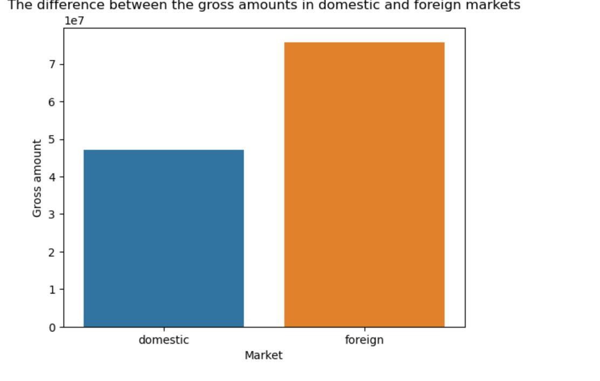

# MOVIE STUDIO ANALYSIS
## Identifying Key Factors For Success in the Film Industry

# OVERVIEW
The movie studio industry faces increasing pressure to maximize efficiency, minimize costs, and improve profitability while remaining competitive in an ever-changing market. With the growing complexity of film production, distribution, and marketing, studios must leverage data-driven insights to make informed decisions and stay ahead of industry trends.

# Problem Statement
This problem revolves around understanding and improving the operational performance of movie studios using data analytics. The goal is to identify inefficiencies, optimize production pipelines, and propose actionable recommendations to enhance overall business performance.
# Objectives
1. Analyze the trend in movie sales over time to identify shifts in audience demand.
2. Identify key market segments to target for maximum engagement and revenue generation.
3. Assess the popularity of different film genres to guide genre selection in alignment with audience preferences.
4. Evaluate the impact of movie runtime on popularity to determine optimal lengths for future productions.
# Data sets used
https://github.com/Seryabiz/Phase_2_Project/blob/main/DATA/bom.movie_gross.zip

# Data Analysis
Python Libraries used were; 

# Findings
## 1. Trends in movie sales over time

