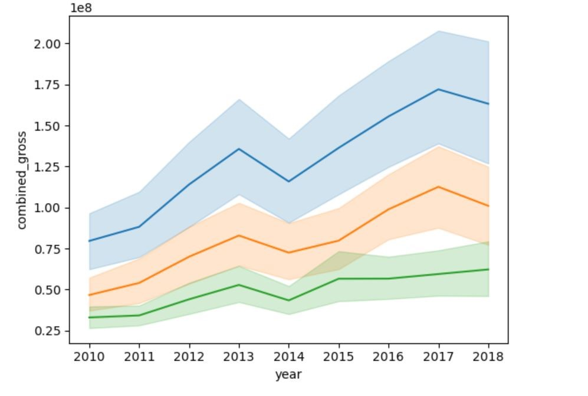

# MOVIE STUDIO ANALYSIS
## Identifying Key Factors For Success in the Film Industry

# OVERVIEW
The movie studio industry faces increasing pressure to maximize efficiency, minimize costs, and improve profitability while remaining competitive in an ever-changing market. With the growing complexity of film production, distribution, and marketing, studios must leverage data-driven insights to make informed decisions and stay ahead of industry trends.

# Problem Statement
This problem revolves around understanding and improving the operational performance of movie studios using data analytics. The goal is to identify inefficiencies, optimize production pipelines, and propose actionable recommendations to enhance overall business performance.
# Objectives
1. Analyze the trend in movie sales over time to identify shifts in audience demand.
2. Identify key market segments to target for maximum engagement and revenue generation.
3. Assess the popularity of different film genres to guide genre selection in alignment with audience preferences.
4. Evaluate the impact of movie runtime on popularity to determine optimal lengths for future productions.
# Data sets used
https://github.com/Seryabiz/Phase_2_Project/blob/main/DATA/bom.movie_gross.zip
https://github.com/Seryabiz/Phase_2_Project/blob/main/DATA/im.db.zip
# Data Analysis
The Python Libraries used were; Pandas, Numpy, Sqlite3, seaborn, matplotlib, scipy.stats, statsmodels.api, zipfile,sklearn.model selection, sklearn.metrics and sklearn.linear model

# Findings
## 1. Trends in movie sales over time
There has been an increase in the sales of the movies over time indicating that the industry's demand has been on the rise.

## 2. Key market segments to target for maximum engagement and revenue generation
There is a difference in the amounts gained in the foreign market and in the domestic market. The foreign market has more returns than the domestic market. This could be attributed to the size of the two markets.

## 3. popularity of different film genres to guide genre selection in alignment with audience preferences
 The Comedy, Documentary, Fantasy genre is the most popular

## Impact of movie runtime on popularity to determine optimal lengths for future productions
The heatmap confirms that the runtime does not affect the popularity. The genre of the movie is however anticipated to affect the popularity of the movie.

# Recommendations
1. As shown in the domestic gross against year line graph , there has been an increase in the sales of the movies over time indicating that the industry's demand has been on the rise, therefore this venture is viable for the company and could definitely be explored.
2. The company should focus on maximizing on the foreign market sales.This is because from the market against gross amount bar plot, there is a difference in the amounts gained in the foreign market and in the domestic market. The foreign market has more returns than the domestic market. 
3. The company should consider  benchmarking at studios with HC as they are at the top. This would help in adoption of practices that these top studios do to achieve the numbers that they have over the years. 
4. The company's studio should not focus on the runtime but other factors of quality that will make the movies more popular. The heatmap confirms that the runtime does not affect the popularity and thus the company's studio should not focus on the runtime but other factors of quality that will make the movies more popular eg the genre of the movie.
5. The Comedy, Documentary, Fantasy genre is the most popular and therefore the studio should therefore venture into producing that genre.

# Conclusion
The research done and the results found indicate that the company's plan of starting a movie studio is a viable venture and should therefore be explored. To ensure that the venture is profitable the recommendations mentioned in the report should be taken into consideration. The industry is ever changing and constant research and always keeping up to date with changes in consumer preferences and the financial performance of the industry.

